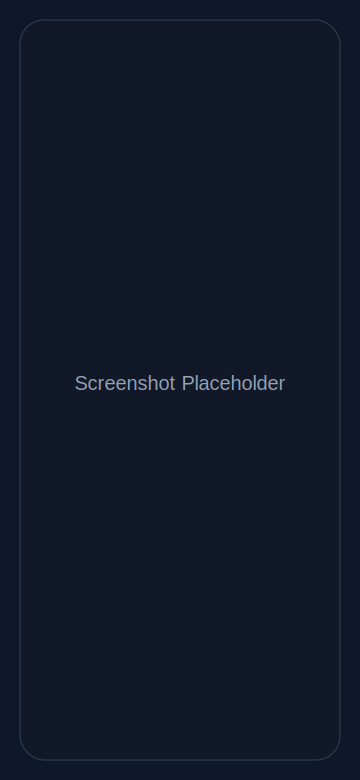

# GitPeek

> Discover repositories, explore developer profiles, and inspect project activity from a modern Android app built with Jetpack Compose.

GitPeek helps developers quickly answer questions like:
- *What repositories are trending for a topic?*
- *What does a user build and star?*
- *Is this repository active, and what issues are open?*

---

## ✨ Why use GitPeek?

GitPeek is designed for fast GitHub exploration on mobile. Whether you're scouting open-source projects, researching collaborators, or reviewing repos before contributing, GitPeek gives you a clean, focused, and touch-friendly experience.

### Key features

- 🔎 **Repository Search** with paginated results
- 👤 **GitHub Profile View** for user details
- 📦 **User Repositories** listing (paged)
- 💾 **Offline-first paging cache** for Search + User Repositories (Room + RemoteMediator, 30-minute TTL)
- ⭐ **Starred Repositories** listing (paged)
- 📄 **Repository Details** (owner, stats, metadata)
- 🐞 **Issues Browser** for open project issues
- 🔐 **Optional GitHub Personal Access Token (PAT)** support for higher API rate limits
- 🧱 **Modular architecture** for clean scaling and easier contribution

---

## 🛠 Tech stack

- **Language:** Kotlin
- **UI:** Jetpack Compose + Material 3
- **Architecture:** Multi-module, feature-first separation, ViewModel + use-case style domain layer
- **DI:** Hilt
- **Networking:** Retrofit + OkHttp
- **Pagination:** Paging 3
- **Persistence:** Room (offline cache for repository paging) + DataStore (token storage)
- **Build system:** Gradle Kotlin DSL + Version Catalog

---

## 🧭 Architecture (high-level)

```text
                         +----------------------+
                         |      :app module     |
                         | Navigation + Screens |
                         +----------+-----------+
                                    |
                    +---------------+---------------+
                    |                               |
            +-------v--------+              +-------v--------+
            | feature:search |              | feature:profile|
            | data/domain/ui |              | data/domain/ui |
            +-------+--------+              +-------+--------+
                    |                               |
            +-------v--------+              +-------v--------+
            |feature:repodetail|            | feature:issues |
            | data/domain/ui   |            | data/domain/ui |
            +-------+----------+            +-------+--------+
                    \                         /
                     \                       /
                      +---------+-----------+
                                |
                       +--------v---------+
                       |  core:database   |
                       | Room cache +     |
                       | cache metadata   |
                       +--------+---------+
                                |
                       +--------v---------+
                       |   core:network   |
                       | Retrofit, DTOs,  |
                       | auth, mappers    |
                       +--------+---------+
                                |
                          GitHub REST API

                       +------------------+
                       |     core:ui      |
                       | theme/components |
                       +------------------+

                       +------------------+
                       |   core:model     |
                       | shared models    |
                       +------------------+
```
# RepoVista Android Scaffold

[](https://github.com/your-org/your-repo/actions)
[](LICENSE)
[](CONTRIBUTING.md)

Multi-module Android scaffold using **Gradle Kotlin DSL** and **Version Catalog**.

---

## 🚀 Getting started

### Prerequisites

- Android Studio (latest stable recommended)
- Android SDK configured (project targets SDK 35)
- JDK 17 (recommended for modern Android builds)

### 1) Clone the project

```bash
git clone <your-fork-or-this-repo-url>
cd GitPeek
```

### 2) Open in Android Studio

- Open Android Studio
- Select **Open** and choose the `GitPeek` project folder
- Let Gradle sync complete

### 3) Run the app

- Create/select an emulator (API 24+), or connect a physical Android device
- Click **Run** on the `app` configuration

### 4) (Optional) Configure GitHub token
Run:

```bash
./gradlew test
./gradlew assembleDebug
```


## 🧠 Offline-first Paging (Search + User Repos)

GitPeek now uses **Room + Paging 3 RemoteMediator** for repository search and user repository lists.

- Cached pages are shown instantly from local DB when available.
- Remote refresh runs in the background and updates cached content.
- Cache entries are invalidated after **30 minutes**.
- If API calls fail, previously cached pages remain available (cache is not wiped on errors).
- UI still consumes `PagingData<RepoSummary>` the same way as before.

## Community

- Read [CONTRIBUTING.md](CONTRIBUTING.md) before opening a PR.
- Follow our [CODE_OF_CONDUCT.md](CODE_OF_CONDUCT.md).
- Use GitHub issue templates for bugs and feature requests.

## GitHub token setup (optional)

Unauthenticated GitHub API calls are limited. You can optionally set a Personal Access Token (PAT) in the app:

1. Launch the app
2. Open **GitHub Token Settings**
3. Paste token and tap **Save**

Notes:
- Token is stored locally with DataStore Preferences
- Clear token by saving an empty value
- Authorization header is redacted in HTTP logging

---

## 🖼 Screenshots

> Add screenshots or GIFs here to showcase the app flow.

| Search | Profile | Repo Detail | Issues |
|---|---|---|---|
|  |  |  |  |

---

## 🤝 Contributing

Contributions are welcome and appreciated.

1. Fork the repository
2. Create a feature branch:
   ```bash
   git checkout -b feat/your-feature-name
   ```
3. Make your changes
4. Run checks:
   ```bash
   ./gradlew test
   ```
5. Commit and push your branch
6. Open a Pull Request with a clear description and screenshots (if UI-related)

### Contribution tips

- Keep modules focused and cohesive
- Prefer small, reviewable PRs
- Follow existing naming and package conventions
- Add/update documentation for user-facing or architectural changes

---

## 📄 License

This project is licensed under the **MIT License**.

```text
MIT License

Copyright (c) 2026 GitPeek contributors

Permission is hereby granted, free of charge, to any person obtaining a copy
of this software and associated documentation files (the "Software"), to deal
in the Software without restriction, including without limitation the rights
to use, copy, modify, merge, publish, distribute, sublicense, and/or sell
copies of the Software, and to permit persons to whom the Software is
furnished to do so, subject to the following conditions:

The above copyright notice and this permission notice shall be included in all
copies or substantial portions of the Software.

THE SOFTWARE IS PROVIDED "AS IS", WITHOUT WARRANTY OF ANY KIND, EXPRESS OR
IMPLIED, INCLUDING BUT NOT LIMITED TO THE WARRANTIES OF MERCHANTABILITY,
FITNESS FOR A PARTICULAR PURPOSE AND NONINFRINGEMENT. IN NO EVENT SHALL THE
AUTHORS OR COPYRIGHT HOLDERS BE LIABLE FOR ANY CLAIM, DAMAGES OR OTHER
LIABILITY, WHETHER IN AN ACTION OF CONTRACT, TORT OR OTHERWISE, ARISING FROM,
OUT OF OR IN CONNECTION WITH THE SOFTWARE OR THE USE OR OTHER DEALINGS IN THE
SOFTWARE.
```
